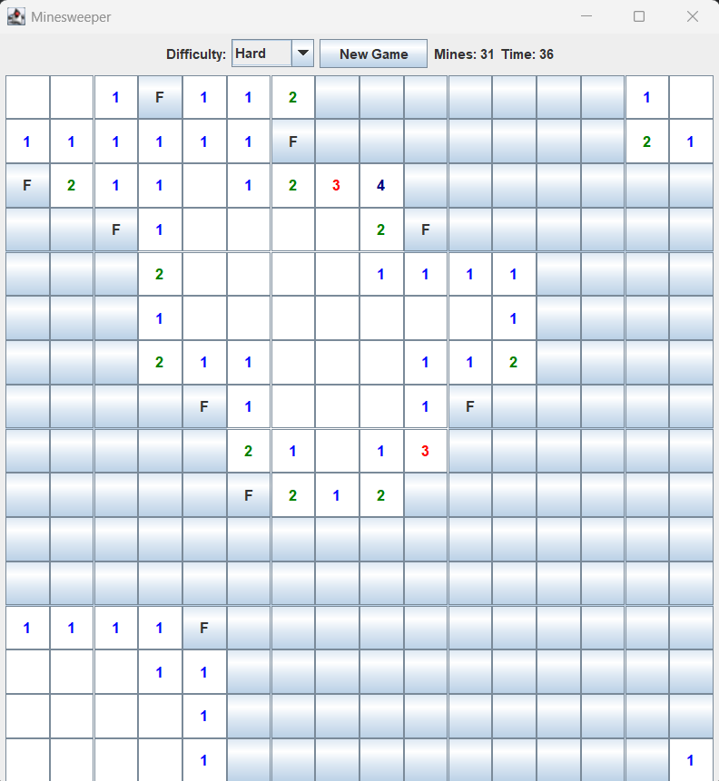

# Java Minesweeper

A desktop implementation of the classic Minesweeper game built from scratch using Java and Swing.

The project focuses on game logic, GUI development, event handling, recursion, and managing game state using Java.

## Features

- Three difficulty levels:
    - Easy: 8×8 board with 10 mines
    - Medium: 12×12 board with 25 mines
    - Hard: 16×16 board with 40 mines
- Random mine generation
- Neighboring mine calculation
- Left-click cell revealing
- Right-click flagging
- Automatic revealing of connected empty cells
- Win and loss detection
- New Game functionality
- Game timer
- Remaining mine/flag counter
- Colored numbers based on neighboring mine count
- Visual distinction between revealed and unrevealed cells

## Technologies

- Java
- Java Swing
- Java AWT

## Concepts Used

The project demonstrates several Java and programming concepts:

- Object-oriented programming
- Two-dimensional arrays
- Recursion
- Event-driven programming
- Swing GUI components
- Mouse and action listeners
- Random number generation
- Game state management
- Timers
- Grid-based algorithms

## How It Works

The game stores the board using several two-dimensional arrays that track mines, neighboring mine counts, revealed cells, and flagged cells.

Mines are randomly placed when a new game begins. Each safe cell calculates how many mines exist in its surrounding eight positions.

When an empty cell is revealed, recursive cell revealing opens connected empty cells and their surrounding numbered cells.

The game tracks the number of safe cells revealed to determine when the player has won.

## How to Play

- Left-click a cell to reveal it.
- Right-click a cell to place or remove a flag.
- Numbers indicate how many mines are adjacent to that cell.
- Reveal every non-mine cell to win.
- Clicking a mine ends the game.
- Use the difficulty selector to change the board size and number of mines.
- Use **New Game** to generate a new board.

## Running the Project

1. Clone or download the repository.
2. Open the project in IntelliJ IDEA or another Java IDE.
3. Make sure a Java JDK is installed.
4. Run `Minesweeper.java`.

## Project Structure

```text
JavaMinesweeper/
├── src/
│   └── Minesweeper.java
├── screenshots/
│   └── gameplay.png
├── .gitignore
└── README.md
```

## Screenshot

